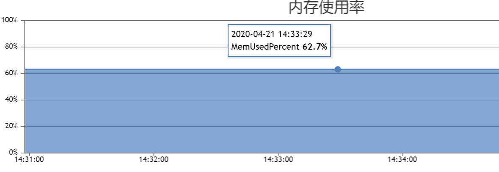

HNSW性能评测
----------------

data_size = 10M, 参数为 InnerProduct, nlinks = 32, efConstruction = 40, efSearch = 64

+-----------------------------------------+-------------+---------+--------------+
|集群                                     |机器配置     |数据维度 |构建索引时间  |
+=========================================+=============+=========+==============+
|master\router\ps各一个，均在一台机器上   |56核256G内存 |128      |28min         |
+-----------------------------------------+-------------+---------+--------------+
|master\router\ps各一个，均在一台机器上   |56核256G内存 |512      |33min10s      |
+-----------------------------------------+-------------+---------+--------------+
|master\router\ps各一台，且在不同机器上   |8核16G内存   |128      |2h38m         |
+-----------------------------------------+-------------+---------+--------------+

**内存使用率**

以8核16G机器为样本进行分析，vearch ps共使用内存16G * 0.627 = 10.032G，其中原始数据特征大小为10M * 128 * 4 ~ 5G，其它为索引以及正排字段占用内存。使用时仅创建一个正排字段和向量字段。

10M数据, 机器配置56核256G，add time = 28min01s, 左侧是构建索引CPU利用率，右侧是搜索时CPU利用率

